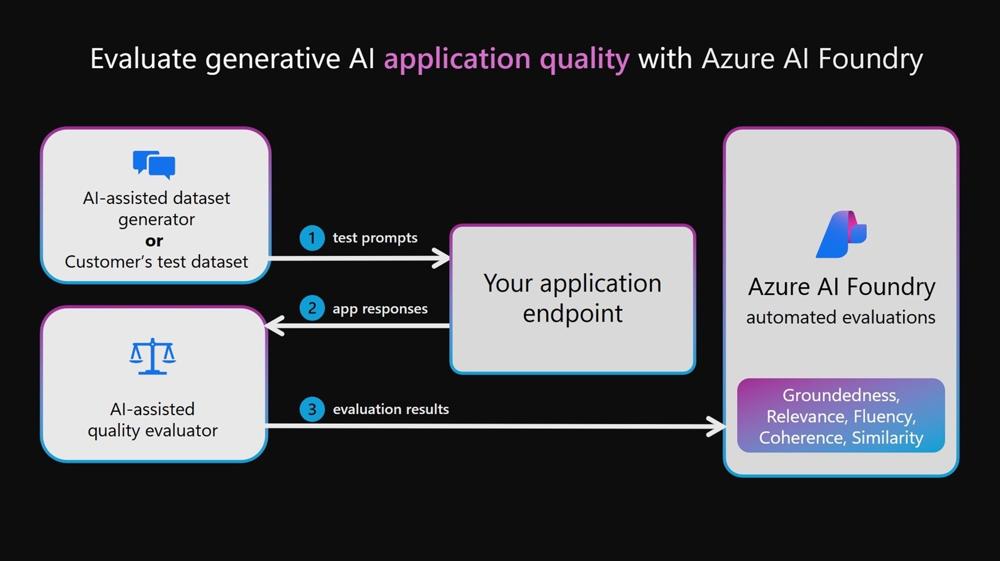

# Application Evaluation
## Overview
First key challenging in GenAI is its non-deterministic nature. Traditional assertion is not effective. We need different mechanism to evaluate the quality of GenAI application. AI Foundry introduction to Prompt flow starts by introduce tooling to support evaluation using metric such as Groundedness or Relevant. This has been particularly useful however it requires application implementation to have direct dependencies with Prompt flow and Python. This is not practical for all use cases. Azure Evaluation SDK has been proposed to decouple evaluation from applications implementation. 

Another challenge when working with Gen AI is having decent quality test data. Golden data set is particularly important to evaluate the quality of the GenAI application. It takes effort and normally require SMEs to generate quality Golden data set hence data set size tends to be limited and does not cover all use cases.

In this lab, you will learn how to run evaluators on manual data set, on an application target endpoint with built-in evaluators using the Azure AI Evaluation SDK then track the results and evaluation logs in Azure AI project. To extend the data set we will use AI Evaluation SDK to generate synthetic data set to enhance test coverage.


## Set up
### Setting up the Dev Container

1. **Install Docker**: Ensure you have Docker installed on your machine. You can download it from [Docker's official website](https://www.docker.com/products/docker-desktop).

2. **Open the Project in VS Code**: Open the `/workspaces/chat-and-hack-feb-2025` directory in Visual Studio Code.

3. **Install Remote - Containers Extension**: Install the "Remote - Containers" extension from the VS Code marketplace.

4. **Reopen in Container**: Press `F1`, then select `Remote-Containers: Reopen in Container`. This will build the dev container as specified in the `.devcontainer` folder.

5. **Wait for Setup**: Wait for the container to build and set up. This may take a few minutes.

6. **Verify**: Once the container is running, verify that all necessary services are up and running inside the container.


### Setting up Azure OpenAI Instance

1. **Create an Azure Account**: If you don't have an Azure account, create one at [Azure's official website](https://azure.microsoft.com/).

2. **Create an Azure OpenAI Resource**:
    - Go to the [Azure Portal](https://portal.azure.com/).
    - Click on "Create a resource" and search for "Azure OpenAI".
    - Click "Create" and fill in the required details to set up your Azure OpenAI resource.

3. **Deploy a Model**:
    - Navigate to your Azure OpenAI resource.
    - Go to the "Deployments" section.
    - Click on "Create" to deploy a new model.
    - Choose the model you want to deploy and configure the necessary settings.

4. **Get Endpoint and Key**:
    - After deploying the model, go to the "Keys and Endpoint" section of your Azure OpenAI resource.
    - Copy the endpoint URL and the API key. You will need these for the next steps.

### Setting up AI Foundry

1. **Create or Use Existing AI Foundry**:
- Navigate to the [AI Foundry Portal](https://portal.azure.com/).
- If you already have an AI Foundry instance, select it from the list.
- If you need to create a new instance, click on "Create Foundry" and follow the prompts to set up a new AI Foundry instance.

2. **Select Identity-Based Access**:
- During the setup or configuration of your AI Foundry instance, ensure that you select "Identity-Based Access" to manage permissions and access controls.

3. **Role Assignment**:
- Ensure you grant  "Storage Blob Data Contributor" and "Storage File Data Privileged Contributor" role to your credential with AI Foundry's storage Account.

### Set up parameters
1. **Create a `.env` File**  
- Store your Azure OpenAI configuration, AI Foundry details, and application credentials in separate key-value pairs.
```
AZURE_OPENAI_API_VERSION=2024-08-01-preview
AZURE_OPENAI_DEPLOYMENT=sample-deployment
AZURE_OPENAI_ENDPOINT=https://sample-aoai-endpoint.azure.com/
AZURE_OPENAI_KEY=sampleKey1234
AZURE_SUBSCRIPTION_ID=sample-subscription-id
AZURE_AI_FOUNDRY_RESOURCE_GROUP=sample-resource-group
AZURE_AI_FOUNDRY_PROJECT_NAME=sample-project
APPLICATION_ENDPOINT=https://sample-app-endpoint.azure.com/score
APPLICATION_KEY=sampleApplicationKey1234
```

2. **Run `az login`**  
   - Use the Azure CLI to authenticate your account.

## Lab
The lab use a existing endpoint implemented in the application_endpoint.py. We have prepare a sample application to use. Please reach out to Ha Duong for end point detail.
If you want to use your own application endpoint then it is also possible with the same concept.

We have a set of note books for each scenario. Each notebook are independent from each other so you can choose to run 

| Notebook                                        | Description                                              |
|-------------------------------------------------|----------------------------------------------------------|
|[Manual_Evaluation](Manual_Evaluation.ipynb)     | Application evaluation with golen data set               |
|[Simulate_Evaluation](Simulate_Evaluation.ipynb) | Generate and evaluate application with generate data set |
