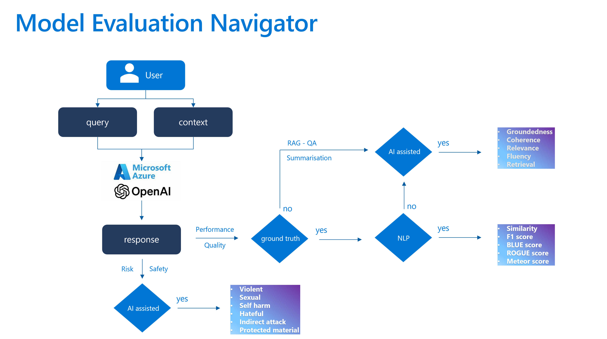
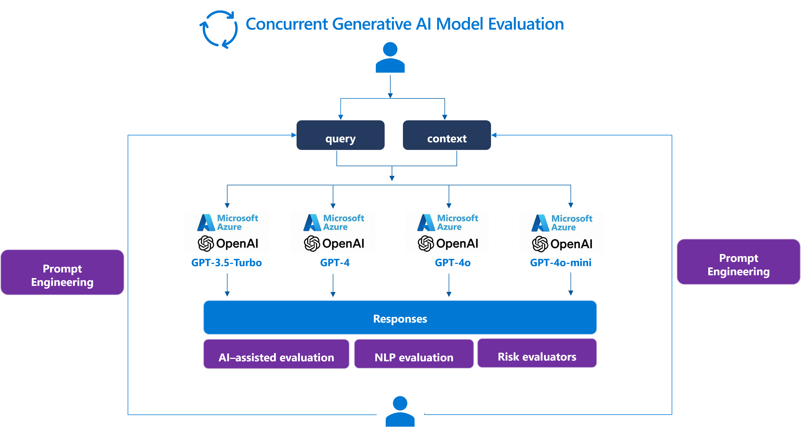
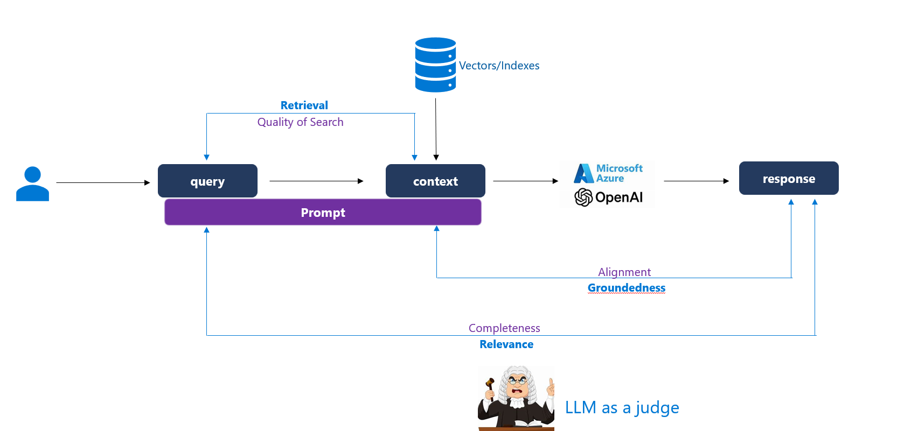

# Evaluate generative AI
## Overview
Evaluations are systematic processes of assessing the performance, reliability, and efficacy of generative AI applications. These assessments involve a series of tests and metrics designed to quantify how well an AI model performs its intended task. The goal is to ensure that the AI application behaves as expected, providing accurate and relevant outputs in various scenarios.
Evaluations are crucial for several reasons:
•	Quality Assurance: They help in ensuring that the AI systems meet the desired standards of accuracy and reliability.
•	Performance Metrics: Evaluations provide essential data on the effectiveness of the AI app’s outputs, highlighting areas for improvement.
•	Bias Detection: They help in identifying and measuring the prevalence of biases present in the AI model, highlighting areas for improvement.
•	User Trust: AI applications that perform consistently well help build trust with users, earning higher satisfaction and usage.

# AI-assisted evaluations with Azure
Evaluating generative AI models presents unique challenges due to their dynamic and often creative outputs. Traditional evaluation methods might not fully capture the intricacies of generative models, necessitating more specialized approaches. As such, we provide AI-assisted evaluations which use machine learning techniques to augment the evaluation process. The choice of models for AI-assisted evaluation can significantly affect the results. Therefore, we recommend testing and comparing your evaluations with the supported GPT 3.5, GPT 4, or GPT4o model for your calculations.
You have the flexibility to run evaluations with Azure either through the UI in Azure AI Foundry or programmatically with the Azure AI Evaluation SDK. Both tools provide access to a series of Performance & Quality and Risk & Safety metrics. However, programmatically, you also can create your own code-based and prompt-based custom evaluators, and also log your custom evaluators to your Azure AI project.

Set up environmentals variables for Azure OpenAI models deployments associated keys in the credentials.env
```
AZURE_SUBSCRIPTION_ID=""
AZURE_TENANT_ID=""
AZURE_RESOURCE_GROUP=""
AZURE_PROJECT_NAME="" ## Create a project and hub in AI Foundry

# AI assitant Judge (GPT4o prerferbaly as this most learned and accurate)
AZURE_OPENAI_ENDPOINT=""
AZURE_OPENAI_API_KEY=""
AZURE_OPENAI_DEPLOYMENT=""
AZURE_OPENAI_API_VERSION=""

# Model1
AZURE_OPENAI_GPT35_ENDPOINT=""
AZURE_OPENAI_GPT35_API_KEY=""

# Model2
AZURE_OPENAI_GPT4_ENDPOINT=""
AZURE_OPENAI_GPT4_API_KEY=""

# Model3
AZURE_OPENAI_GPT4o_ENDPOINT=""
AZURE_OPENAI_GPT4o_API_KEY=""

# Model4
AZURE_OPENAI_GPT4o-mini_ENDPOINT=""
AZURE_OPENAI_GPT4o-mini_API_KEY=""
```
## AOAI model metrics evaluation navigator



## AOAI base models performance and quality eveluation 
This involves assessing the different AOAI base model using same prompt for accuracy, groundedness, and relevance of generated content using robust AI-assisted metrics.



## Lab
This lab use a AI-assited single aoai model endpoints for evaluation for groundedness. we use Prompt-based groundedness using your own model deployment to output a score and an explanation for the score is currently supported in all regions.Effectively, the model is behaving as judge
```
Class GroundednessProEvaluator: This is an experimental class, and may change at any time. Please see https://aka.ms/azuremlexperimental for more information.
{'gpt_groundedness': 5.0,
 'groundedness': 5.0,
 'groundedness_reason': 'The response accurately and completely answers the '
                        'query using the information provided in the context.'}
{'groundedness_pro_label': True,
 'groundedness_pro_reason': 'All Contents are grounded'}
```




We have a set of note books for each scenario. Each notebook are independent from each other so you can choose to run 

| Notebook                                        | Description                                               |
|-------------------------------------------------|-----------------------------------------------------------|
|[Single_Model_AI-assisted_Evaluation](ai_evaluation.ipynb)     | Prompt-based AI-assisted Groundedness evaluation using single model deployment|
|[Multiple_Model_AI-assisted_Evaluation](evaluate_base_model_endpoint.ipynb) | Evaluate multiple model concurrantly with example curated dataset|
