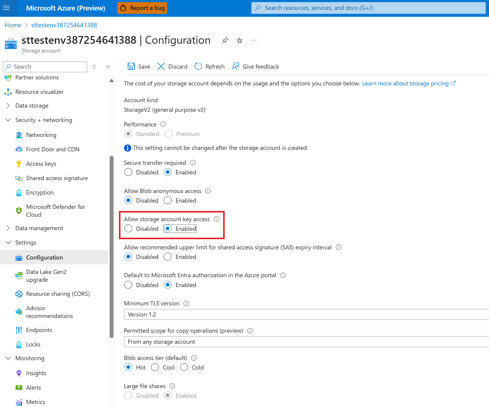

## Set up
### Setting up the Dev Container

1. **Install Docker**: Ensure you have Docker installed on your machine. You can download it from [Docker's official website](https://www.docker.com/products/docker-desktop).

2. **Open the Project in VS Code**: Open the `/workspaces/chat-and-hack-feb-2025` directory in Visual Studio Code.

3. **Install Remote - Containers Extension**: Install the "Remote - Containers" extension from the VS Code marketplace.

4. **Reopen in Container**: Press `F1`, then select `Remote-Containers: Reopen in Container`. This will build the dev container as specified in the `.devcontainer` folder.

5. **Wait for Setup**: Wait for the container to build and set up. This may take a few minutes.

6. **Verify**: Once the container is running, verify that all necessary services are up and running inside the container.

### Setting up with Python or Conda Environment 

Create a virtual Python environment of you choice. 
To create one using conda, run the following command in bash terminal
```
conda create -n model_eval
conda activate model_eval
```
To create one using python in powershell, run the following command in powershell terminal
```
python -m venv model_eval
.\model_eval\Scripts\Activate.ps1
```
To create one using python in bash, run the following command in bash terminal
```
python -m venv .model_eval
source .model_eval/bin/activates
```

### Building and running

Install the required packages by running the following command:
```
pip install -r requirements.txt
```

### Setting up Azure OpenAI Instance

1. **Create an Azure Account**: If you don't have an Azure account, create one at [Azure's official website](https://azure.microsoft.com/).

2. **Create an Azure OpenAI Resource**:
    - Go to the [Azure Portal](https://portal.azure.com/).
    - Click on "Create a resource" and search for "Azure OpenAI".
    - Click "Create" and fill in the required details to set up your Azure OpenAI resource.

3. **Deploy a Model**:
    - Navigate to your Azure OpenAI resource.
    - Go to the "Deployments" section.
    - Click on "Create" to deploy a new model.
    - Choose the model you want to deploy and configure the necessary settings.

4. **Get Endpoint and Key**:
    - After deploying the model, go to the "Keys and Endpoint" section of your Azure OpenAI resource.
    - Copy the endpoint URL and the API key. You will need these for the next steps.

### Setting up AI Foundry

1. **Create or Use Existing AI Foundry**:
- Navigate to the [AI Foundry Portal](https://portal.azure.com/).
- If you already have an AI Foundry instance, select it from the list.
- If you need to create a new instance, click on "Create Foundry" and follow the prompts to set up a new AI Foundry instance.

2. **Select Identity-Based Access**:
- During the setup or configuration of your AI Foundry instance, ensure that you select "Identity-Based Access" to manage permissions and access controls.

3. **Role Assignment**:
- Ensure you grant  "Storage Blob Data Contributor" and "Storage File Data Privileged Contributor" role to your credential with AI Foundry's storage Account.

4. **Storage Account Key Access**
- On the AI Foundry resource storage. Plesse enable storage account key access to allow storage access.


